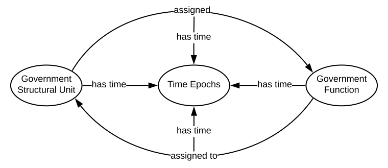
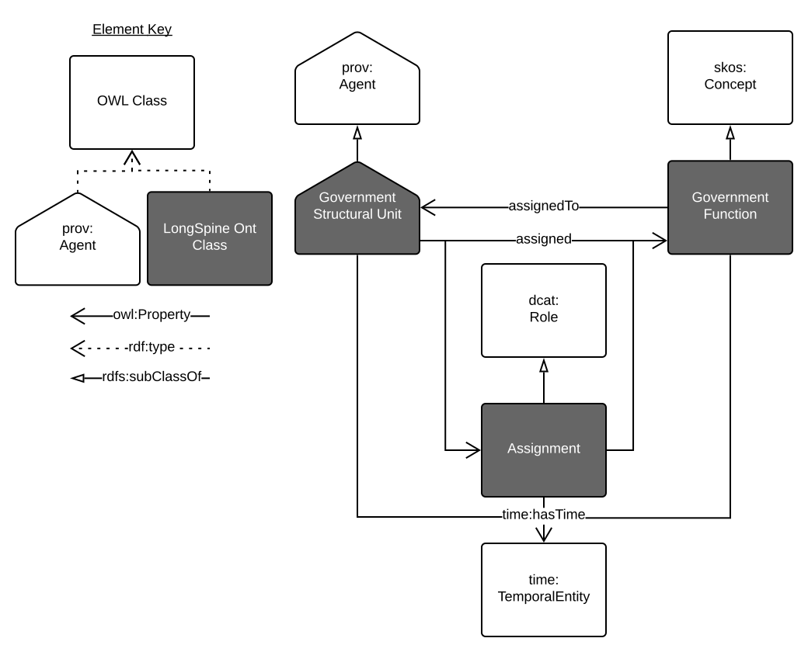

# LongSpine Overarching Ontology
An abstract model of the Longitidunal Spine of Government Functions project's main content.

This [Web Ontology Language (OWL)](https://www.w3.org/2001/sw/wiki/OWL) model is a high-level (abstract or 'upper') model that describes the general classes of object and relations between them that all [LongSpine](https://longspine.cat) *Datasets* implement.

This model declares ony a couple of its own classes and properties and inherits most of its content from existing, well-known and models, such as [Thge Organization Ontololgy](https://www.w3.org/TR/vocab-org/).

## Overview
Figure 1 is an informal overview of the content of this ontology. See Figure 2 further below for the formal ontology diagram.

  
**Figure 1**: Conceptual overview of the LongSpine Overarching Model

## Repository content
* [README.md](README.md) - this file
* [overarching-model.svg](overarching-model.svg) - the overview diagram shown in Figure 1
* **[longspine.ttl](longspine.ttl) - the formal definition of this model, stored according to the [Resource Description Framework (RDF)](https://www.w3.org/2001/sw/wiki/RDF) in the [turtle](https://www.w3.org/TR/turtle/) file format**
* [longspine.svg](longspine.svg) - OWL diagram of the ontology. Figure 2 below
* [LICENSE](LICENSE) - the license for this repository
* [imports/*](imports) - a directory containing the existing ontologies that this model inherits from
* [CSIRO_Logo.svg](CSIRO_Logo.svg) - CSIRO's logo for the branding of this repo and the ontology (top of this file)

## Example
An example:

This overarching model would relate the example fact that *Government Unit X* is associated with *Function Y* like this:

`<GovernmentStructuralUnit_X> <assigned> <GovernmentFunction_Y> .`

The [National Archives of Australia](http://www.naa.gov.au)'s [Commonwealth Record Series Ontology](http://linked.data.gov.au/def/crs) contains `CommonwealthOrganisation` and `Function` classes of object so if it were describing the relation above, it could do it like this:

`<CommonwealthOrganisation_X> <performs> <Function_Y> .`

Where `CommonwealthOrganisation` is a specialised type of `GovernmentStructuralUnit`, `Function` (as defined in the CRS Ontolgy) is a specialised form of `GovernmentFunction` and `performs` is the CRS Ontology synonym for `assigned`.

## Formal ontology diagram
The formal diagram for this ontology is Figure 2 below. It should obviously correlate to the overview diagram above in Figure 1 however it conveys the formal modelling in the [longspine.ttl](longspine.ttl) RDF file defining this ontology.

  
**Figure 2**: OWL diagram of the classes and properties in this LongSpine Ontology

## License
This ontology and all other content in this repository are licensed under the [Creative Commons Attribution 4.0 International (CC BY 4.0)](https://creativecommons.org/licenses/by/4.0/) (local copy of deed: [LICENSE](LICENSE)).

## Contacts
Creator:  
**Nicholas Car**  
*Senior Experimental Scientist*  
CSIRO Land & Water, Brisbane, Australia  
<nicholas.car@csiro.au>  
<http://orcid.org/0000-0002-8742-7730>  
